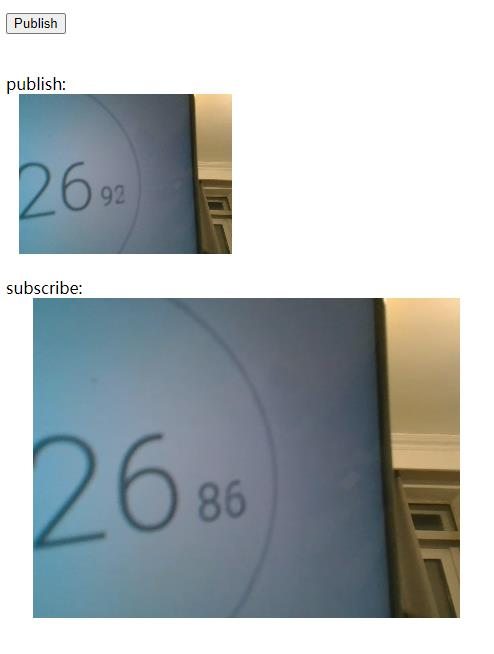
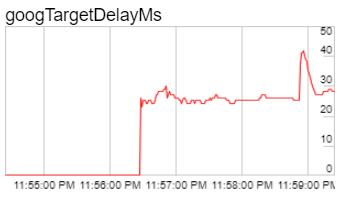
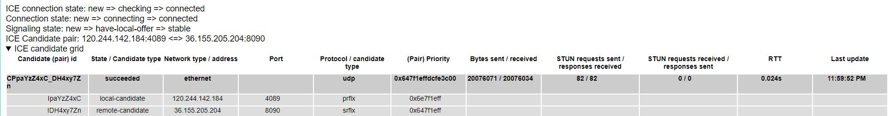
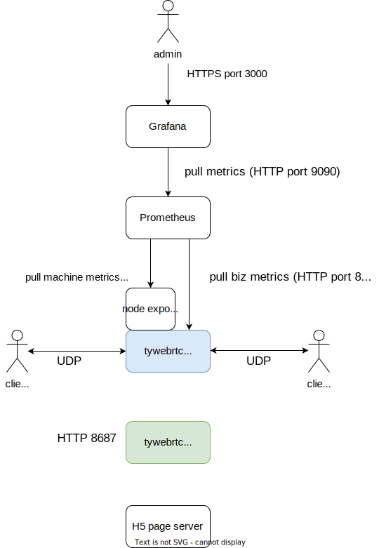

# tywebrtc
WebRTC server play

# 项目背景
与家人使用微信视频通话，感到延迟比较大（北京到上海），回声严重，我听到自己回声后才听到对方的回复，本项目开发一个简洁的传输服务，用户用浏览器进行视频通话，产品目标是延迟比微信的低，并借助浏览器WebRTC天然的回声消除能力，做到比微信视频通话体验更好，同时让通话者方便接入，前期忽略身份安全问题。

本项目的第一原则是，不要让开发者易错，最大限度地减少问题的发生，即使出现问题也要快速排查，这一点将贯穿每一行代码，例如在日志中不要打印不直观的数字，比如net order或者host order的IP数字，这种需要把IP字符串打印出来，否则查问题的人需要把这个数字用工具转为可读的IP浪费时间。本项目尽可能做到简单自包含、依赖少，**有朋友有额外需求的话方便自行修改和扩展，碰到问题看源码能hold住并解决**，这就要求代码架构和可读性良好，错误处理做得好（这跟技术没什么关系了，就看你是否站在开发者用户的角度），市面上有的开源项目代码难懂，出问题不好排查，很多情况不是阅读者的问题，而是代码质量的问题 :)

其次，本项目为了练手才造的轮子，其他开源项目可能有80%的代码是我不需要的，只需要核心的20%的代码实现的功能。

# 一些设计决策和宗旨
- 收发包的buffer用`std::vector<char>`，严禁C风格数组:)，不用unique_ptr<char[]>, unique_ptr<uint8_t[]>，它们没法知道buffer长度，别再加长度变量，也别再定义一个包含指针和长度的结构体了，这些都是不必要的徒增复杂性的东西，对本条有异议请参考 https://stackoverflow.com/questions/1399891/c-vectorchar-and-sockets/1400289 。代码中尽量不出现new关键字，优先用STL，从根本上避开内存泄露问题，不手动管理内存后，理论上无需写复制构造函数、重载赋值操作符、析构函数（C++典型问题之一，写不必要的Rule of Three）。这样理论上不会有内存泄漏问题，但有一种情况需要注意，多态时定义基类的虚析构函数 https://stackoverflow.com/questions/461203/when-to-use-virtual-destructors
- 严禁magic number。同样体现在日志中，比如打印enum、时间戳、net/host order IP数字，这些都要开发者二次处理才知道含义
- 某些场景用std::string代替enum，方便直接打印有意义的名称而不是数字
- 用C++风格而不是C风格（重要），如用默认构造函数代替memset，用std::string 代替 strlen, strcpy，要求开发者有较高的C++水平，请先阅读Effective C++和谷歌编程规范
- 重视单元测试、代码格式化（build时强制执行:)）、持续集成（含代码静态分析）、code review
- 如果需要打印类的状态，增加成员函数 std::string ToString() const; 先不考虑转字符串的性能问题，扩展性和可读性优先
- 收拢构造函数、clear、init、reset、reinit等等给成员变量批量赋值的场景，否则以后加一个字段要到处修改
- 越重要的变量、函数、类型，命名的辨识度越高，这点和Golang的命名习惯是一样的，平常可能要经常搜索这些命名，辨识度高可以准确grep
- 允许线上打印本地日志，这就要求日志库的高性能
- 严禁全局变量（前期可能有，后期会重构）
- 可以用局部变量时就不要分配堆对象，Java程序员转C++时请注意
- 尽量不出现原生指针，比如可以用引用代替指针，免得到处判空，容易遗漏出现空指针解引用问题
- 简单自包含、依赖少。每个项目或多或少需要一些util函数，boost、abseil提供了这样的功能，但又不是需要全部，而且需要单独安装这些库，有的环境下不允许从软件源直接安装，而且可能有版本问题，手动编译可能需要先装CMake，CMake可能有版本问题需要先源码编译安装，这违背了本项目简单自包含的原则:)，提升了开发者安装试用本项目的门槛，笔者见过最优雅的是Lua源码的编译，一键make搞定，在cygwin下也没出问题，这是本项目学习的目标。至于util函数，放在笔者的另一个仓库tylib中，按需加入函数，它的原则同样是“拿来就用”，很多是头文件
- 配置文件的考量：服务的本地配置通常用YAML比较合适，但它也有缺点，见 https://en.wikipedia.org/wiki/YAML#Criticism ，比如空格缩进表示层级，K8s上用YAML作为配置文件，内容很多层级可读性不好，编辑时也容易出错；项目尽量少引用第三方库；SRS 的讨论 https://github.com/ossrs/srs/issues/2277#issuecomment-1234186528 ，综合考虑目前使用环境变量方式作为配置。

# 运行本项目
```
$ git clone --recursive https://github.com/Justme0/tywebrtc.git
$ cd tywebrtc
$ ./build.sh # only compile, exe file is tywebrtc; NOTE: my bazel version is 7.1.1
$ ./tywebrtc # run
```

更新
```
$ git submodule update --remote
```

# 效果
client demo 位于 webclient/ 下，目前写死的SDP，支持Chrome，运行请修改 candidate 地址为你的服务器访问地址。

笔者运行效果如下，client(北京) -> server(南京) -> client(北京) 端到端延迟60ms:



其中client到server的RTT占27ms:

```
7 packets transmitted, 7 received, 0% packet loss, time 6003ms
rtt min/avg/max/mdev = 25.649/27.907/32.317/2.044 ms
```

传输+解码+渲染耗时 [target_delay_ms](https://source.chromium.org/chromium/chromium/src/+/main:third_party/webrtc/media/base/media_channel.h;l=670;drc=1e6c1a39cbbc1dcad6e7828661d74d76463465ed;bpv=1;bpt=1):
Target overall delay: network+decode+render, accounting for min_playout_delay_ms.



端到服务器 ICE RTT：



# 代码架构
(在线阅读本项目代码推荐 https://sourcegraph.com/github.com/Justme0/tywebrtc )


